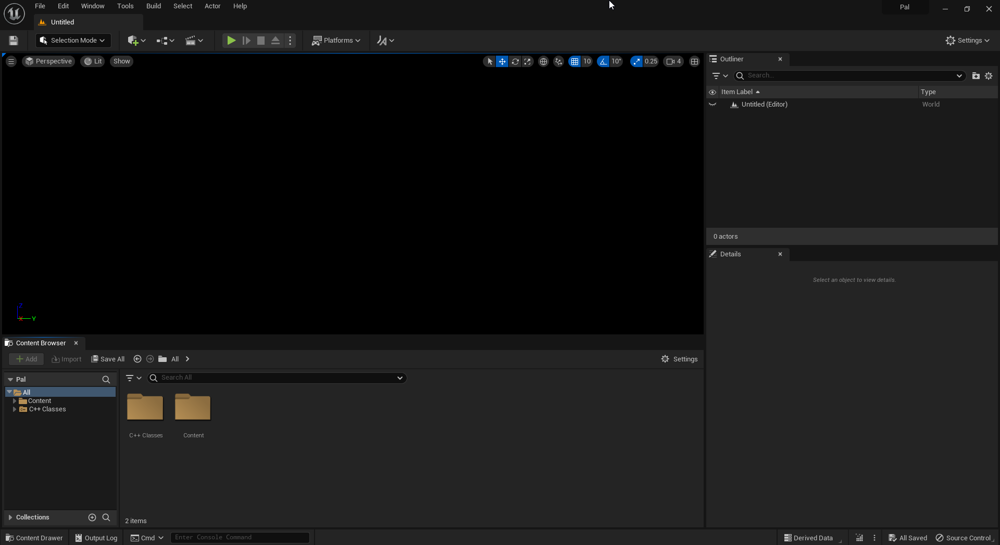
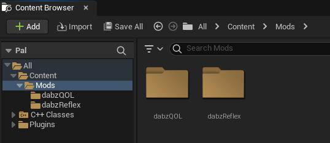
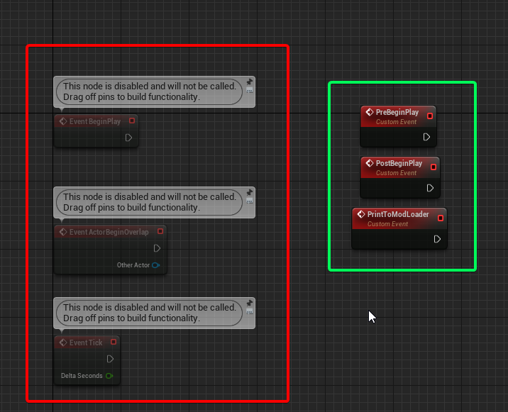
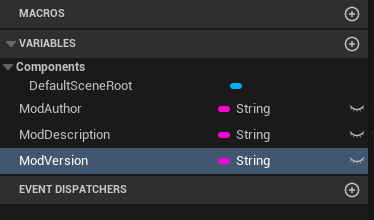
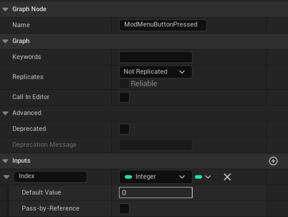
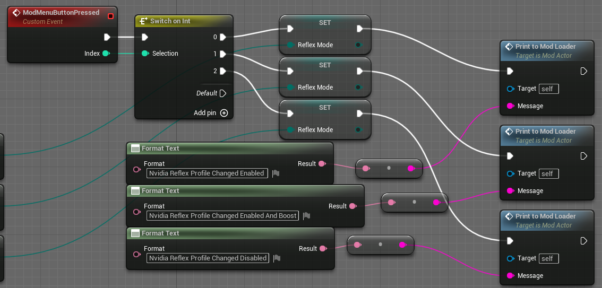

# Setting Things Up - Part 1

Where we left off would be Double-clicking `Pal.uproject`, You should see this screen

## ModActor Setup

1) In your `Content Browser` If there isnt a folder named `Content` make one.
2) In `Content` make a folder called `Mods` This is where any mod we make will be at.
3) Your folder structure should look similar below. (***Ignoring dabzQOL and dabzReflex***) 
4) Create a folder in `Mods` with the name you want your Mod's Pak file to be called. (In this case, I'll be using dabzReflex)
5) In that folder, We will be creating a new `Blueprint Class` that is a `Actor`. It will be called **_ModActor_** 
6) Now your Content Browser should look like so, next double-click your `ModActor` and make sure you are on the `Event Graph` tab 
7) Now your ModActor is technically setup, there is some more information to know about it below though.

## ModActor Events

### Used Events
- PreBeginPlay - This event is too early to use to initialize your mod. (Only Works In Mod Actor)
- PostBeginPlay - This event is fired when the Player Controller Begin Play is called (Only Works In Mod Actor)
  - The suggested event to use for initializing most things in your mod.
- PrintToModLoader - Allows the ability to log to UE4SS Console through a blueprint.
  - To use this event, Create a `Custom Event` in your `ModActor` called `PrintToModLoader` exactly.
  - Add a initial String variable to this event, called `Message`. Leave the event alone now.
  - You can now call a new function called `Print To Mod Loader` anywhere.
- ModMenuButtonPressed - Used to enable ModButtons in UE4SS's mod list area. (Only Works In Mod Actor)

### Unused Events

:::warning
These events shouldn't really be used!
:::

- EventBeginPlay
- EventActorBeginOverlap

:::tip
Anything in the red box, should not be used.

Anything in the green box, is suggested for use. (ModMenuButtonPressed is suggested for use, It's just not listed)
:::

## ModActor Variables

:::tip
ModActor variables are used to display information about your mod in UE4SS's loaded mod category.

They are simply just variables added to your blueprint, that arnt used by your blueprint.

:::

### Mod Strings
- ModAuthor - Shows Author in UE4SS Mods panel
- ModDescription - Shows Description for mod in UE4SS Mods Panel
- ModVersion - Shows Version for mod in UE4SS Mods Panel

### Mod Buttons

- Create a String Variable called ModButtons in your ModActor, In the properties panel change the following to the 9 squares in a box 

  - Create a new custom event called `ModMenuButtonPressed` 
  
  - Under the newly created event, Add a input variable that is a `Integer` named `Index` 
  - Next add a `Switch on Int` action, connected to the `ModMenuButtonPressed` event.
    - For every single button you wish to have, you will add a pin to this `Switch On Int`
    - Your pin's must match up to `ModButtons String Array` 
    - When a `ModButton` is clicked, it will send a Exec signal, through which every integer is connected to it.  

### Basic Example Of ModButtons & PrintToModLoader
