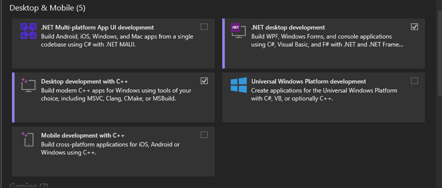
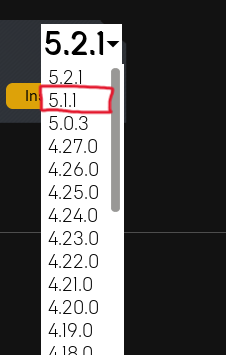
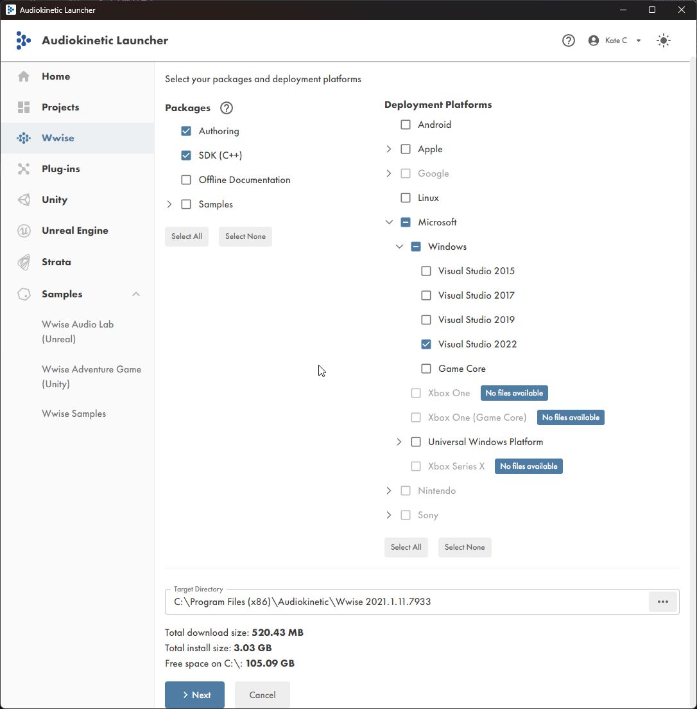
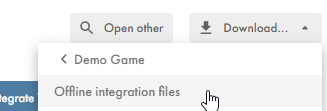

# Installation Of The PDK - Part 1

## Prerequisites

### .NET 6

For unreal build tools to function correctly, you will need to have .NET 6 installed on your system, head over to [this link](https://dotnet.microsoft.com/en-us/download/dotnet/6.0/runtime?cid=getdotnetcore&os=windows&arch=x64). Here, click on the `Download x64` button to download the runtime:

Afterwards, open the installer, and install the runtime.

### Visual Studio 2022

To compile the sdk you will need Visual Studio 2022 installed, you can grab it from [this](https://visualstudio.microsoft.com/vs/) link. A community edition version will suffice. While installing it, make sure to check the following components in the installer:

Then press continue, and wait for visual studio to install.

### Unreal Engine 5.1

After installing Visual Studio, we need to install Unreal Engine. To do so, open Epic Games Launcher, and head over to the `Unreal Engine` tab. Here, go to the `Library` tab, and press on the little yellow plus button to add a new version:

After this, you should see a new card appear with the ability to select an engine version, open the dropdown and select `5.1`, like this:

> [!NOTE]
> Any 5.1 version will work, it doesn't matter if it's 5.1 or 5.1.1

### Wwise

Palworld uses Wwise for it's sounds, so we will need to install this too.

> [!IMPORTANT]
> Even if you are not planning on making sounds, you still need wwise, otherwise the project will not compile

To install wwise, go to [this](https://audiokinetic.com/) website, and press `Download Audiokinetic Launcher`:

This will require you to make an account. After downloading the launcher, install it and log in. Head over to the `Wwise` tab. On the bottom of your screen you should see an `Install A New Version` header. Select `2021.1.11` as your wwise version and press install:

On the next page, select:

* SDK (C++)
* Microsoft -> Windows -> Visual Studio 2022

The selection should look like so:

Now press next, on the plugins page you don't need to add any plugins, so hit install!

After installing the Wwise sdk, head over to the `Unreal Engine` tab, there press on the `Download` button, and select `Offline integration files`:

In the integration version, choose the same wwise version you chose when installing the sdk, and remember the download directory, now hit install!
