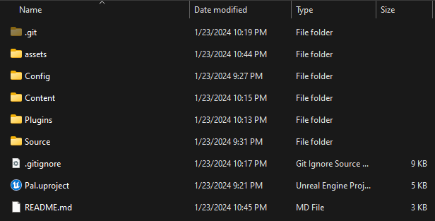
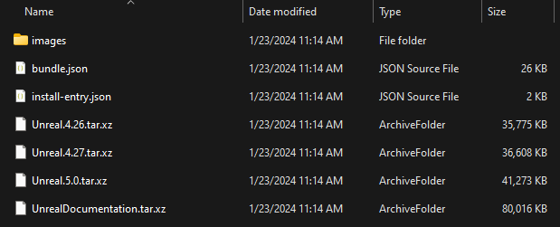
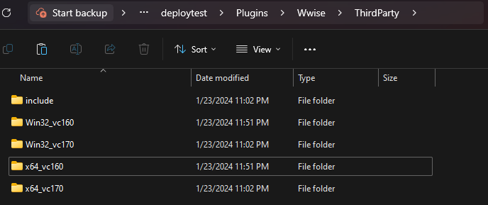
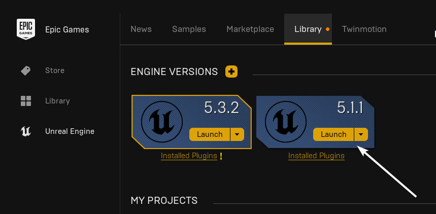

# Installation Of The PDK - Part 2

With the prerequisites out of the way, we are ready to download the sdk.

## Repository Setup

Download The Project Here
<iframe src="https://ghbtns.com/github-btn.html?user=localcc&repo=PalworldModdingKit&type=star&size=large&text=false" frameborder="0" scrolling="0" width="170" height="30" title="GitHub"></iframe> 


After downloading the repo, unpack it anywhere you want, and you should see the following file structure:



## Wwise integration

Before continuing to open the sdk in unreal, we must integrate Wwise manually. This is because the Wwise version that the game uses, is not officially compatible with the engine version, so we have to manually copy it over.

Open the directory you downloaded offline installation files for Wwise in, you should see the following structure:



Unpack the `Unreal.5.0.tar.xz` archive.

:::note
You might need to do it twice, first time you unpack it, you might get a .tar file, unpack that one too.
:::

Copy over the unpacked `Wwise` folder into the `Plugins` folder of the SDK.

Almost done with Wwise integration, now we just need to copy over the needed dlls.

Open the `Wwise` folder inside the SDK, and create a `ThirdParty` folder there.

Now go to the folder where you installed the Wwise SDK

:::warning
This is not the folder where you installed the integration files, but the folder where you installed the SDK
:::

```text title="Default Wwise SDK Path"
C:\Program Files (x86)\Audiokinetic\Wwise 2021.1.11.7933\SDK
```

Inside of this folder, select:

* `Win32_vc170`
* `x64_vc170`
* `include`

And copy over those folders to the `ThirdParty` folder.

After copying over those folders, make sure to duplicate the `vc170` folders as `vc160` also, so the structure will look as follows:



:::note
If you continue without the following change, you will have to click OK on a dialog box that says Wwise is not compatible with the current Unreal Engine version every time you load up the editor.
:::

To fix this, navigate to `Plugins\Wwise` and open `Wwise.uplugin` with any text editor or ide. 

Then change the entry `"EngineVersion" : "5.0.0",` to `"EngineVersion" : "5.1",`.

Yay! Now we are done with integrating wwise!

## Changing build tools from VS 2019 to VS 2022
In Unreal Engine 5.1, by default, Visual Studio 2019 build tools will be used if they are installed.

:::warning
The below changes should only be made if Visual Studio 2019 is installed alongside Visual Studio 2022.
:::

<details>
    <summary>If you don't see "Unreal Engine" in `%APPDATA%`</summary>
    <div>
        If you don't see "Unreal Engine" in `%APPDATA%` that means you haven't launched Unreal Engine before<br/>
        Go to `Epic Games Launcher -> Unreal Engine -> Library 0 >` Click "Launch" on the Unreal Engine version that you've downloaded (5.1.x).<br/>
        <br/>
        Let it load until you see the creation of a new project screen then close it and continue with the guide.<br/>
    </div>
</details>

To change this, navigate to `%APPDATA%\Unreal Engine\UnrealBuildTool` and open `BuildConfiguration.xml` with your favorite XML editor.


```xml title="Initial Configuration"
<?xml version="1.0" encoding="utf-8" ?>
<Configuration xmlns="https://www.unrealengine.com/BuildConfiguration">
</Configuration>
```


```xml title="Updated it to look like so:"
<?xml version="1.0" encoding="utf-8" ?>
<Configuration xmlns="https://www.unrealengine.com/BuildConfiguration">
    <VCProjectFileGenerator>
        <Version>VisualStudio2022</Version>
    </VCProjectFileGenerator>
    <WindowsPlatform>
        <Compiler>VisualStudio2022</Compiler>
    </WindowsPlatform>
</Configuration>
```

:::tip
Congratulations on making it through the configuration!
:::

