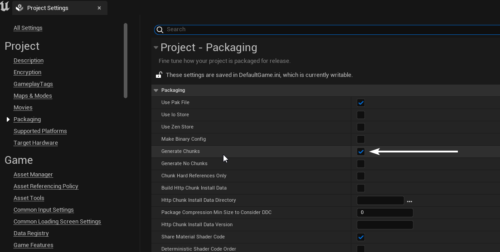

# Exportieren des Projekts

:::note
Stelle sicher diese zwei Optionen sind eingestellt  
:::

1) Erstelle ein Data Asset ( Primary Asset Label ) benannt nach dem Namen deiner Mod in deinem Contents-Ordner. Setzte die Priorität auf 1, und die Chunk-ID zu einer merkbaren ID.
2) Setz die Chunk-ID deiner Mod (ModActor und alle anderen Assets, die ihr in eure Mod einbauen wollt) auf die gleiche, die ihr oben verwendet habt.
3) Gehe zu **Projekteinstellungen -> Asset Manager** und überprüfe, ob die Einstellungen den folgenden entsprechen (stelle sicher, dass die Regeln mit dem erstellten Primary Asset-Label übereinstimmen) 
4) Wenn alle Chunk-IDs in jeder Mod-Datei übereinstimmen, kann das Projekt verpackt werden 
5) Es sollte nun `pakchunk{Your Chunk ID}-Windows.pak` im Paks Ausgabe Ordner sein. Ändere den Dateinamen zu deinem Modnamen. Nun hast du deine verpackte Mod!

    
Falls du nur 'pakchunk0-Windows.pak' anstelle deiner ID bekommst

    

        Gehe zu **Projekt Einstellungen -> Packaging** 
        Nun wähle  "Cook everything in the project content directory(ignore list of maps below)" 
        
    

:::tip
Denke daran BPModLoader in `Palworld\Pal\Binaries\Win64\Mods\mods.txt` zu aktivieren für UE4SS

:::
