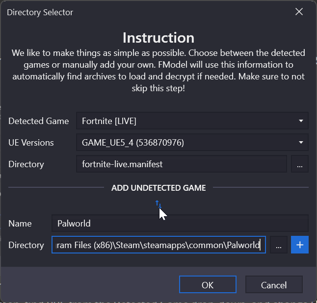

# Starting out

このガイドは[KURAMAAA0](https://github.com/KURAMAAA0/PalModding)によって書かれました。

このガイドは[Latenos](https://github.com/Latenos/PalWorldModDocs)によって日本語に翻訳されました。

はじめにFmodelを起動すると、`Directory Selector`ウィンドウが開かれます。

一番上のドロップダウンにPalworldがない場合は、`ADD UNDETECTED GAME`の下にある矢印のマークをクリックして未検出のゲームを追加します。

Nameには`Palworld`を入力します。 (指定はありませんので、なんでも大丈夫です)

Directoryには`Palworld`の実行ファイルがあるディレクトリを入れます。 デフォルトの設定では`C:\Program Files (x86)\Steam\steamapps\common\Palworld\`になります。

もし見つけられない場合は、`Steam ライブラリ -> パルワールド -> 右クリック -> 管理 -> ローカルファイルを閲覧`から確認できます。開いたフォルダのパスを`Directory`にコピー＆ペーストします。

`OK`をクリックし、FModel上部メニューの`Settings`を開きます。

`Output Directory`は簡単に見つけられるディレクトリに変更することをおすすめします。

`GAME`セクションにある`UE Versions`を`GAME_UE5_1`に変更します。

`ADVANCED`セクションにある`Local Mapping File`のチェックボックスにチェックを入れ、`Mapping File Path`を先ほどダウンロードした[Palworld Mapping File](https://github.com/KURAMAAA0/PalModding/raw/main/Assset%20Swap%20Guide/Mappings.usmap "Palworld mapping file")へ指定します。

Settingsの左側にある`Models`タブをクリックします。

`Model Export Directory`は簡単に見つけられるディレクトリに変更することをおすすめします。

`Mesh Format`を`ActorX (psk / pskx)`に変更します。

`Texture Format`を`PNG`に変更します。

`OK`をクリックしてFModelを再起動します。

------------

これで、ゲームファイルの検索とエクスポートが自由にできるようになりました！
どのファイルをエクスポートすればよいかは、以下のガイドを参照してください。
- [3Dアセットのエクスポートと編集 (パル、アイテム、その他...)](ExportingModifying3DAssets.md "3Dアセットのエクスポートと編集 (パル、アイテム、その他...)")
- [[WIP] 3Dアセットのエクスポートと置き換え (パル、アイテム、その他...)](ExportingReplacing3DAssets.md)
- [[WIP] 2Dアセットのエクスポートと編集 (アイコン、HUD、画像)](ExportingModifying2DAssets.md)
- アニメーション？ まだ試しておらず、可能かは不明です。WIP
