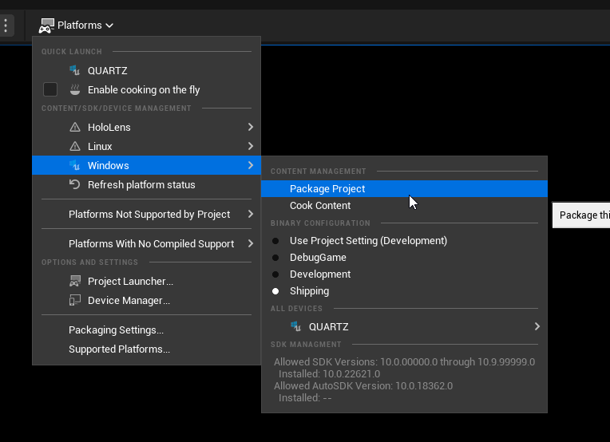
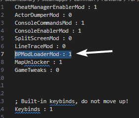

# プロジェクトのエクスポート

:::note
以下の2つの設定が有効になっていることを確認して下さい。  
:::

1) ContentsフォルダにMOD名にちなんだ名前のData Asset ( Primary Asset Label )を作成する。優先度を1に設定し、Chunk IDを分かりやすいIDに設定する
2) Mods  (ModActorとその他MODに含めるアセット) のChunk IDを上記のものと同じものに設定する
3) **Project Settings -> Asset Manager**へ行き以下のような設定になっているか確認する(ルールが作成したPrimary Asset Labelと一致していることを確認して下さい) 
4) 各MODファイルに含まれる全てのChunk IDが一致したら、プロジェクトをパッケージングすることができます。 
5) Paksの出力フォルダに`pakchunk{Your Chunk ID}-Windows.pak`があるはずです。それをMOD名にリネームして下さい。これこそあなたのパッケージしたMODです!

    
分かりやすいIDではなく'pakchunk0-Windows.pak'のみ生成される場合

    

        **Project Settings -> Packaging**へ行く。 
        "Cook everything in the project content directory(ignore list of maps below)"にチェックを入れる。 
        
    

:::tip
UE4SSのために`Palworld\Pal\Binaries\Win64\Mods\mods.txt`でBPModLoaderを有効にすることを忘れないこと。

:::